# IntelliHeal - AI-Powered Test Automation Platform

[](https://python.org)
[](LICENSE)

IntelliHeal is an intelligent self-healing test automation platform that combines AI-powered element locator healing with comprehensive analytics and reporting. The platform consists of a Python library for test automation and a web dashboard for monitoring and analytics.

## 🚀 Quick Start

### 1. Install IntelliHeal Plugin

```bash
pip install IntelliHeal
```

### 2. Set Up the Platform

```bash
# Clone or navigate to the project directory
cd intelliheal

# Start the platform using Docker Compose
docker compose up -d
```

### 3. Implementation

#### Basic Configuration

Set up environment variables for your project:

```bash
# Platform Settings
export AI_HEALING_APP_TYPE=WEB  # or MOBILE
export AI_HEALING_PLATFORM=WEB  # ANDROID, IOS, or WEB

# AI Provider Configuration
export AI_HEALING_PROVIDER=anthropic  # anthropic, openai, gemini, or groq
export ANTHROPIC_API_KEY=your_anthropic_api_key

# Database Settings (Optional)
export AI_HEALING_DB_ENABLED=true
export DB_HOST=localhost
export DB_PORT=5432
export PROJECT_NAME="Your Project Name"
```

#### Quick Implementation Examples

**1. Basic Decorator Usage**
```python
from intelliheal_pytest import ai_heal

@ai_heal(driver_arg_index=0)
def click_login_button(driver, login_button_locator):
    element = driver.find_element(*login_button_locator["WEB"])
    element.click()

# Usage in test
def test_login(driver):
    login_button = {"WEB": [By.ID, "login_btn"]}
    click_login_button(driver, login_button)
```

**2. Mobile App Testing**
```python
from intelliheal_pytest.interactions.mobile import MobileInteractions

def test_mobile_app(driver):
    mobile = MobileInteractions(driver)
    
    # Multi-platform locators
    login_btn = {
        "ANDROID": [By.ID, "login_button"],
        "IOS": [By.ACCESSIBILITY_ID, "LoginButton"]
    }
    
    # AI-healed interactions
    mobile.click(login_btn)
    mobile.send_keys({"ANDROID": [By.ID, "username"]}, "testuser")
    mobile.swipe_direction("up")
    mobile.scroll_to_element({"ANDROID": [By.ID, "hidden_element"]})
```

**3. Web Testing**
```python
from intelliheal_pytest.interactions.web import WebInteractions

def test_web_app(driver):
    web = WebInteractions(driver)
    
    search_box = {"WEB": [By.NAME, "q"]}
    submit_btn = {"WEB": [By.CSS_SELECTOR, "input[type='submit']"]}
    
    # AI-healed web interactions
    web.click(search_box)
    web.send_keys(search_box, "AI healing")
    web.select_by_text({"WEB": [By.ID, "dropdown"]}, "Option 1")
```

**4. Smart Assertions**
```python
from intelliheal_pytest.interactions.assertions import Assertions, Verifications

def test_with_assertions(driver):
    asserts = Assertions(driver)
    verify = Verifications(driver)
    
    result_locator = {"WEB": [By.CLASS_NAME, "search-result"]}
    
    # AI-healed assertions
    asserts.element_is_displayed(result_locator)
    asserts.text_is_displayed("Search Results")
    
    # Verifications (return boolean)
    if verify._element_visible(result_locator):
        print("Element is visible")
```

For complete documentation and advanced features, see [PLUGINREADME.md](./PLUGINREADME.md).

## 📋 Prerequisites

- Python 3.10+
- Docker and Docker Compose
- PostgreSQL (automatically set up via Docker)

## 🛠️ Platform Setup

The platform uses Docker Compose to orchestrate the following services:

- **PostgreSQL Database**: Stores healing data and analytics
- **Backend API**: FastAPI-based backend for data management
- **Frontend Dashboard**: React-based web interface for analytics and reporting

### Environment Configuration

You can customize the setup by creating a `.env` file:

```bash
# Database Configuration
POSTGRES_USER=postgres
POSTGRES_PASSWORD=postgres
POSTGRES_DB=healing_db

# JWT Configuration  
JWT_SECRET_KEY=your-secret-key-here

# API Configuration
CORS_ORIGINS=http://localhost:3001,http://localhost:3000
```

## 📊 Platform Features

### Dashboard Overview
The platform provides a comprehensive web interface for monitoring your test automation:

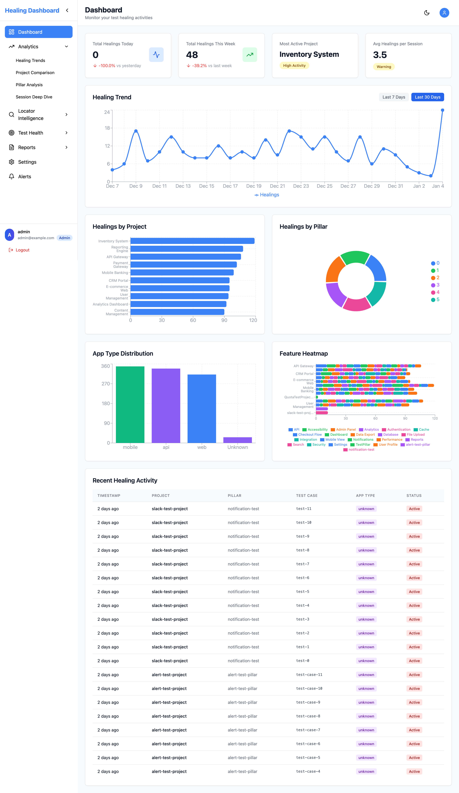

### Analytics & Insights

#### 🔍 Healing Trends Analysis
Track healing patterns and success rates over time:
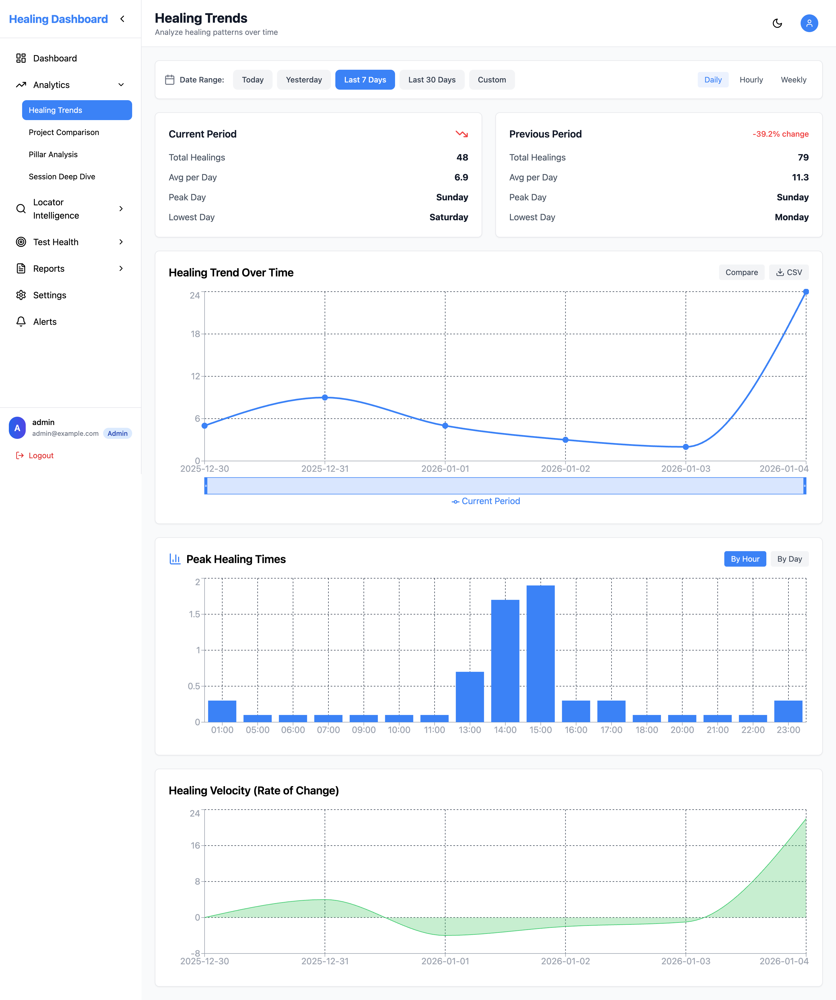

#### 📈 Project Comparison
Compare healing metrics across different projects:
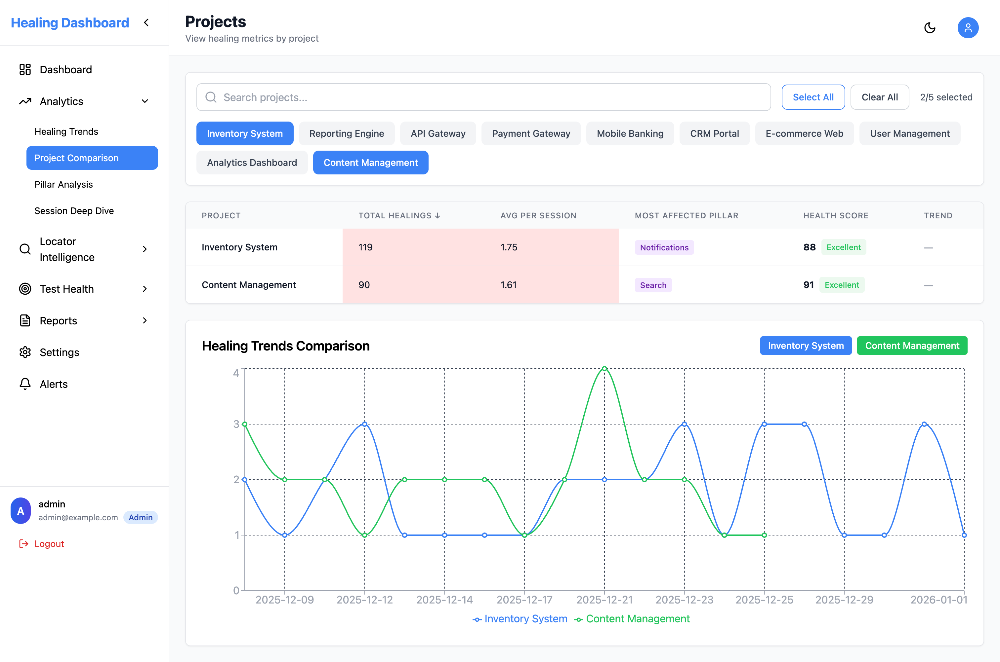

#### 🎯 Pillar Analysis
Understand healing distribution across different test categories:
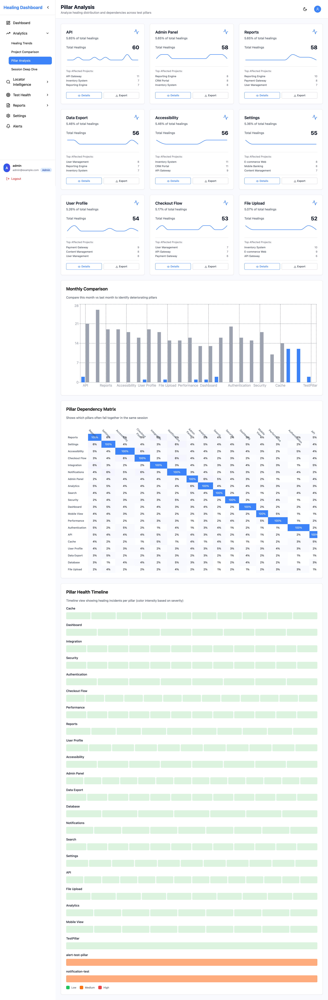

#### 🔎 Session Deep Dive
Detailed analysis of individual test sessions:
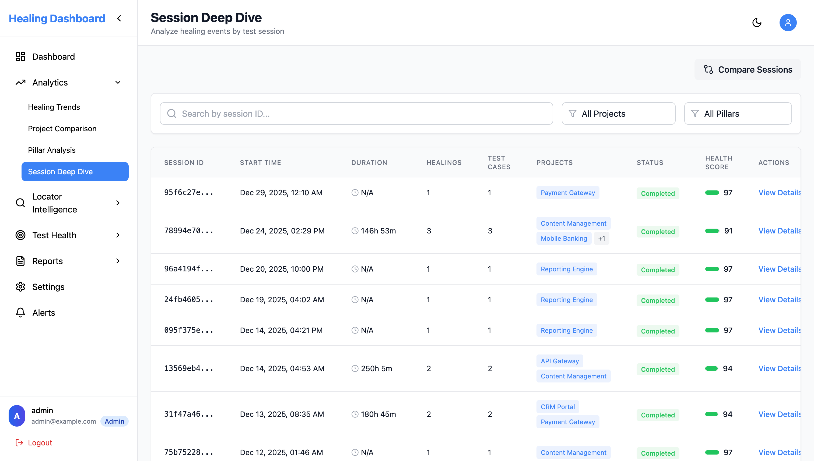

### Locator Intelligence

#### 🧠 Healing Strategies
Analyze which healing strategies work best:
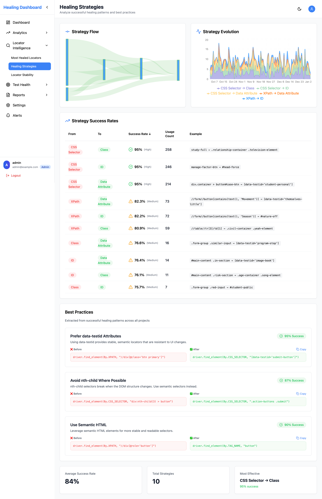

#### 📊 Locator Stability
Monitor locator stability and reliability:


#### 🔧 Most Healed Locators
Identify frequently healed elements for optimization:
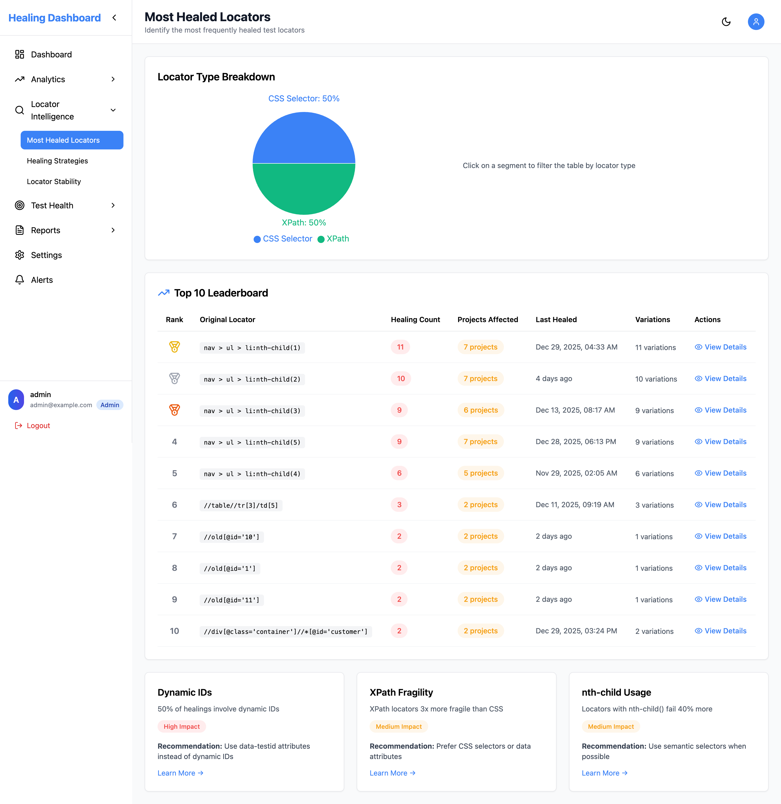

### Test Health Monitoring

#### 🏥 Test Reliability
Monitor overall test suite reliability:


#### 🔄 Healing Frequency
Track healing frequency patterns:
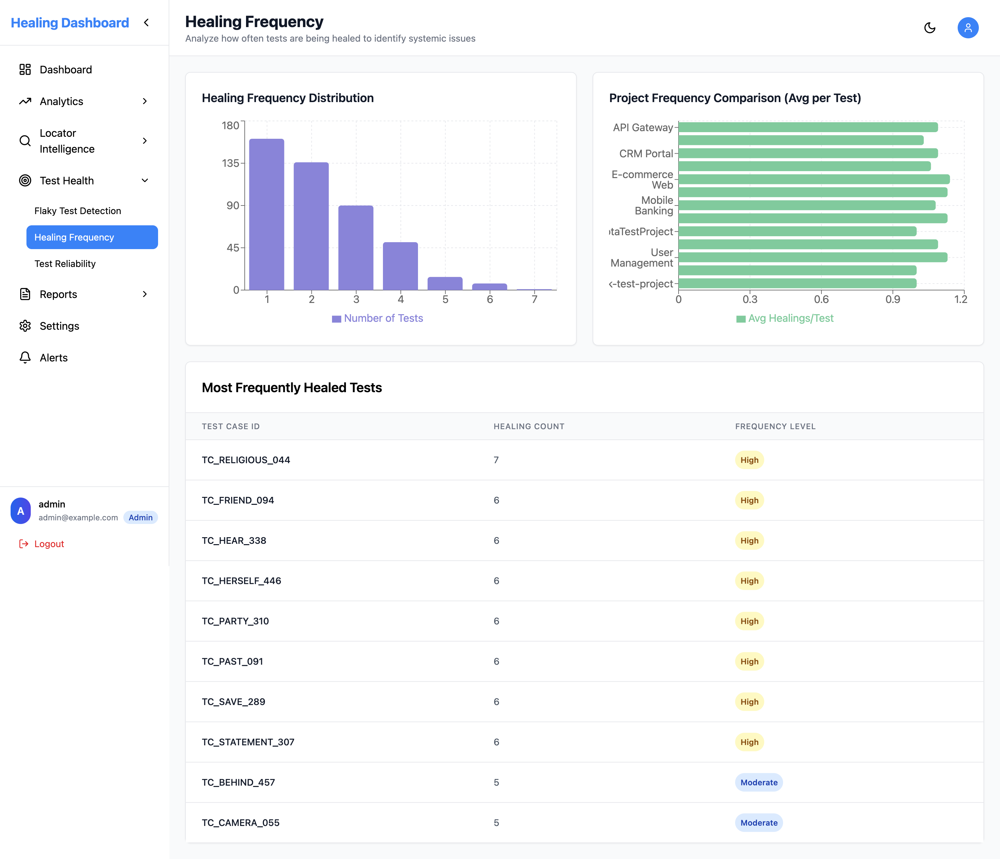

#### 🚨 Flaky Test Detection
Identify and track flaky tests:
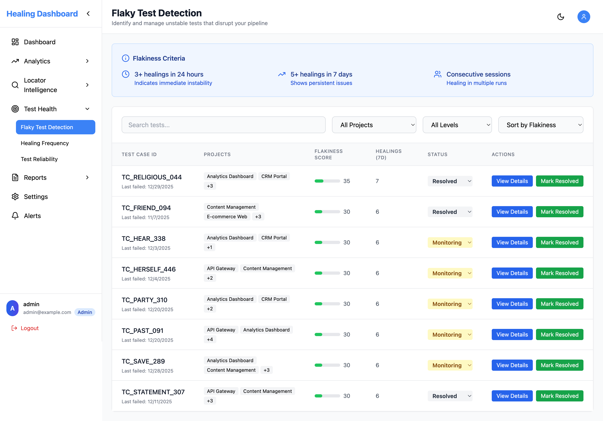

### Reporting & Alerts

#### 📋 Custom Reports
Generate customizable reports for stakeholders:
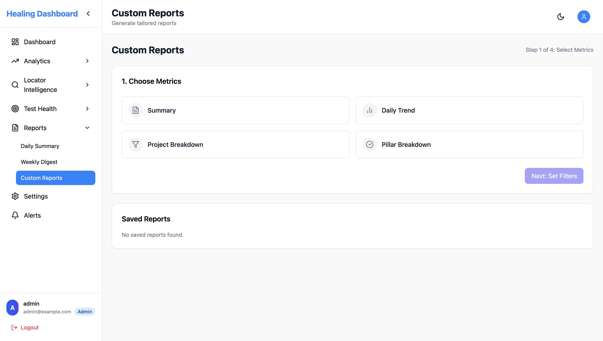

#### 📅 Daily Summary
Automated daily summaries of test health:
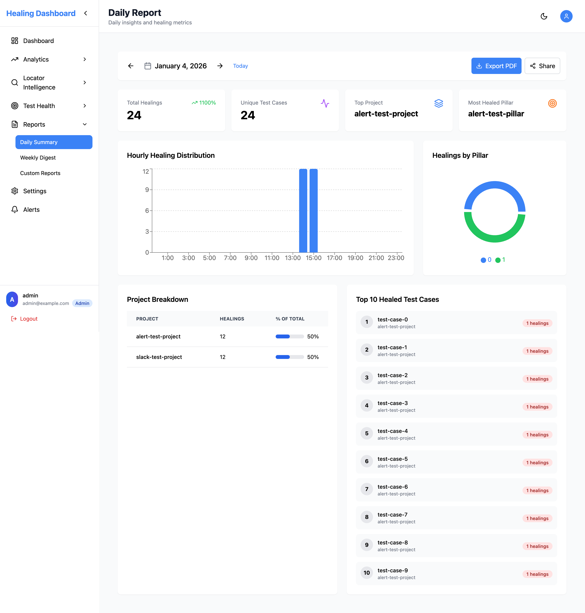

#### 📊 Weekly Digest
Comprehensive weekly analysis:
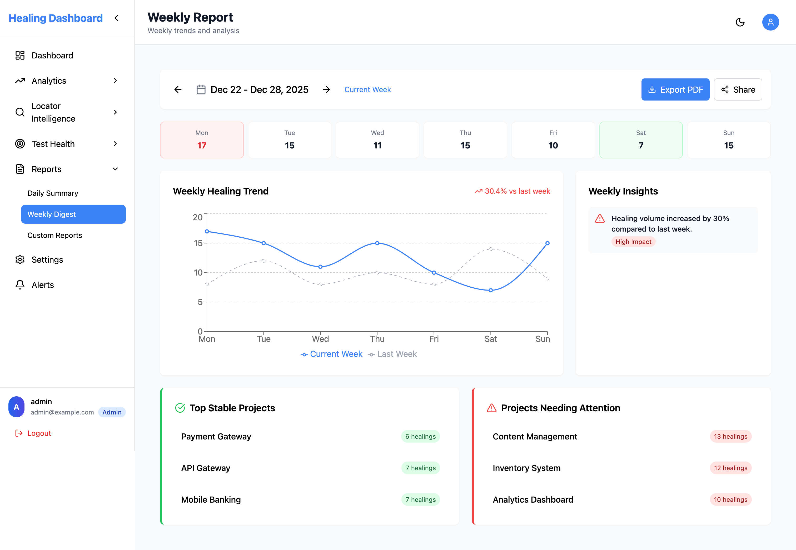

#### ⚠️ Smart Alerts
Configure intelligent alerts for test issues:
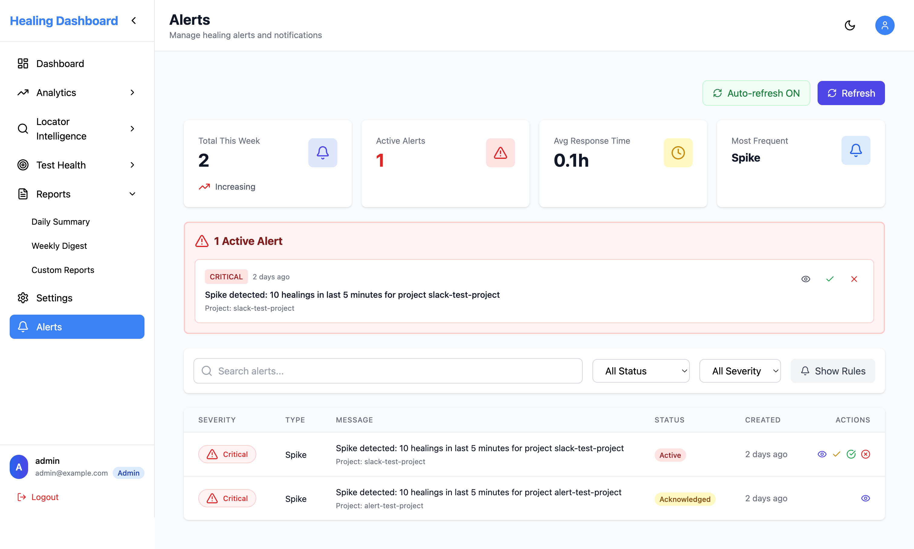

#### ⚙️ Settings Management
Flexible configuration options:
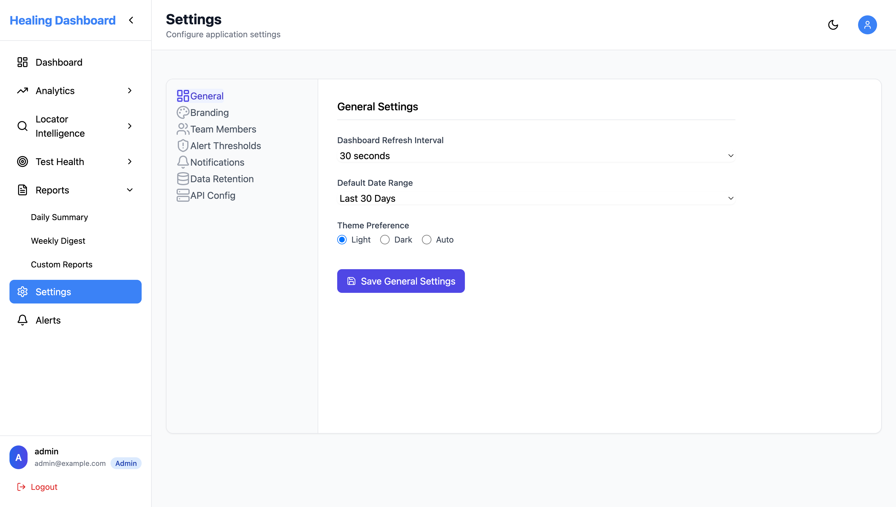

#### 👤 User Login
Secure authentication system:
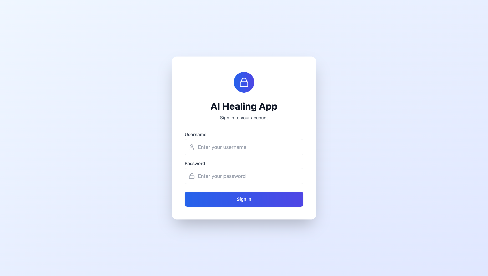

## 🎯 Key Benefits

- **Reduced Test Maintenance**: AI automatically fixes broken locators
- **Comprehensive Analytics**: Deep insights into test health and healing patterns
- **Multi-Platform Support**: Works with web (Selenium) and mobile (Appium) automation
- **Team Collaboration**: Centralized dashboard for team visibility
- **Intelligent Reporting**: Automated reports and alerts
- **Cost Reduction**: Less manual intervention required for test maintenance

## 📚 Documentation

- **Plugin Implementation**: [PLUGINREADME.md](./PLUGINREADME.md) - Complete guide for implementing IntelliHeal in your tests
- **API Documentation**: Access the API docs at `http://localhost:8000/docs` after starting the platform
- **Database Schema**: [database/schema.sql](./database/schema.sql) - Complete database structure

## 🚀 Getting Started with Tests

1. **Install the Plugin**:
   ```bash
   pip install IntelliHeal
   ```

2. **Configure Environment Variables** (see [PLUGINREADME.md](./PLUGINREADME.md) for details):
   ```bash
   export AI_HEALING_APP_TYPE=WEB  # or MOBILE
   export AI_HEALING_PLATFORM=WEB  # or ANDROID/IOS
   export ANTHROPIC_API_KEY=your_api_key
   ```

3. **Start the Platform**:
   ```bash
   docker compose up -d
   ```

4. **Run Your Tests** with IntelliHeal integration and monitor results in the web dashboard at `http://localhost:3001`

## 🤝 Support

For issues, questions, or contributions, please refer to the documentation in [PLUGINREADME.md](./PLUGINREADME.md) for detailed implementation guidance.

---

**Transform your test automation with AI-powered healing and comprehensive analytics!** 🚀